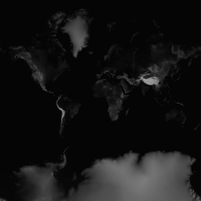

Jaanga Terrain Read Me
======================

  
_terrain/0/0/0.png - the entire globe at zoom level 0_

This and the various other related _Jaanga Terrain_ repositories only contain data.
The terrain data is 3D elevation data for the entire globe in the form of PNG heightmaps derived using the data 
from Jonathan de Ferranti's [Viewfinder Panoramas]( http://www.viewfinderpanoramas.org/ ) web site.

The data may be viewed as maps with a variety of viewers.
Several viewer apps are available from the [_Jaanga Terrain Viewer_]( http://jaanga.github.io/terrain-viewer/index.html ) repository.

Here's what is on the menu:

## Contents

An annotated table of contents with links to all the _Jaanga Terrain_ data repositories on GitHub.  
[Jaanga Terrain Contents]( http://jaanga.github.io/terrain/readme-reader.html#contents.md )

## Overview

The mission and vision for this work - as well as the issues that bring this project into being.  
[Jaanga Terrain Overview]( http://jaanga.github.io/terrain/readme-reader.html#overview.md )

## Technics

The thought processes and the command line arguments that make this project viable. In other words, everything you need to recreate this project for yourself.
[Jaanga Terrain Technics]( http://jaanga.github.io/terrain/readme-reader.html#technics.md  )

## Further Considerations

Aspects and thoughts not covered elsewhere.  This includes discussion on issues/bugs/road map on the current work.  
[Jaanga Terrain Further Considerations]( http://jaanga.github.io/terrain/readme-reader.html#further-considerations.md )

## Thanks

The free open source software movement is wonderful. It's always nice to be able to say 'thank you'.  
[Jaanga Terrain Thanks]( http://jaanga.github.io/terrain/readme-reader.html#thanks.md )

## Project Links

You have two ways of viewing the Jaanga Terrain files:  

* Code hosted on GitHub: [jaanga.github.io]( http://jaanga.github.io/terrain/ "view the files as apps." ) <input value="<< You are now probably here." size=28 style="font:bold 12pt monospace;border-width:0;" >  
* Source code on GitHub: [github.com/jaanga]( https://github.com/jaanga/terrain/ "View the files as source code." ) <scan style=display:none ><< You are now probably here.</scan>

### System Requirements

In order to view the files on this site you will need a device and browser that provides good support for [WebGL](http://get.webgl.org/)
WebGL is the JavaScript API for rendering interactive 3D graphics and 2D graphics within any compatible web browser without the use of plug-ins. 

Generally this means a computer with an Intel Core i5 processor or better with an external GPU such as one made by Nvidia. 
Successful use of the apps on a phone or tablet is highly unlikely. 
A mouse or other pointing device with a scroll wheel is also highly recommended so that you can zoom, pant and rotate in 3D.
 
The apps here are currently being built and tested with the Google Chrome browser. 
Bugs on browsers other than Chrome need not be reported until such time as the work settles down and an effort to support more browsers is initiated.

## Copyright and License
Copyright &copy; 2014 Jaanga authors ~ All work herein is under the [MIT License](http://jaanga.github.io/libs/jaanga-copyright-and-mit-license.md)

This repository is at an early and volatile stage. Not all licensing requirements may have been fully met let alone identified. It is the intension of the authors to play fair and all such requirements will either be met or the feature in question will turned off.

## Change Log

2014-03-15 ~ Theo

* Update reader-readme.html to latest.
* Add text and links to this and the other read me files

2014-01-26-28 ~ Theo

* Too many changes too fast to catalog...

Superseded notes

The current Terrain height maps follow a different projection system than the one used by most Slippy Maps.  We are currently researching the best methods for reconciling the differences.  
  
This repo currently contains every folder and file required to display height maps for Slippy Map levels 0 to 7.  

Currently the folders contain height maps only up to level 7 - After that there is a folder titled 7+ that has...  
 

2014-01-22 ~ Theo

* de Ferranti's 3 second data is online as PNG files
* There is beginning to be a fair description of the issues and the benefits

2014-01-14 ~ Theo

* Data copied over from FGx Terrain and rebuilt. Will now be Jaanga Terrain, FGx Terrain will be revived when there is navigational and aircraft data to be added.
* Data now based on Jonathan de Ferranti's 15 second data,

2013-12-31 ~ Theo

* Updated levels 0 to 4 with Mercator projection height maps.

2013-12-29 ~ Theo

* Added images and demos
* Fresh data for zoom levels 0 to 4
* Updates to read me

2013-12-27 ~ Theo

* Read me updates

2013-12-26 ~ Theo

* Folders and files built and added
* files are all dummy images of the FGx Cap

